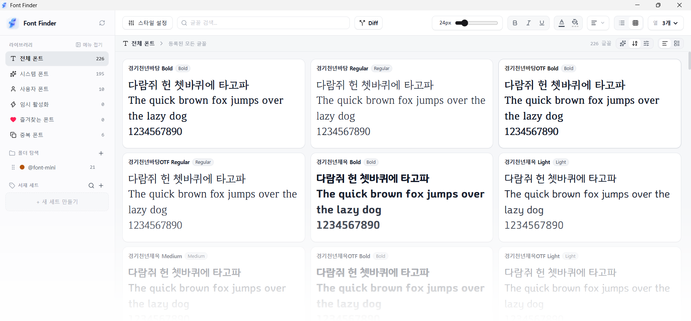

<div align="center">


# FontFinder (폰트파인더)

**Windows와 macOS를 위한 가장 가볍고 감각적인 통합 폰트 관리 프로그램**

[](./LICENSE)
[](#다운로드-및-설치)
[](https://github.com/monodle/fontfinder/releases/tag/latest)


<br>

  <!-- 메인 대표 스크린샷 -->
  

<br>

### 📥 최신 버전 다운로드

깃허브 릴리즈에서 운영체제에 맞는 설치 파일을 다운로드하세요.

[-Download%20.dmg-black?style=for-the-badge&logo=apple&logoColor=white)](https://github.com/monodle/fontfinder/releases/download/latest/Font.Finder_latest_aarch64.dmg)
&nbsp;&nbsp;
[-Download%20.msi%20%2F%20.exe-0078D6?style=for-the-badge&logo=windows&logoColor=white)](https://github.com/monodle/fontfinder/releases/download/latest/Font.Finder_latest_x64-setup.exe)

<p align="center">
  <sub>* 위 버튼 클릭 시 최신 릴리즈 다운로드 링크로 연결됩니다.</sub>
</p>

</div>

<br>

---

## 🌟 왜 FontFinder를 선택해야 할까요?

무거운 폰트 관리 툴에 지치셨나요? **FontFinder**는 디자이너와 크리에이터를 위해 태어난 **초경량·고성능 무료 폰트 관리 솔루션**입니다.

<div align="center">

|                   🪶 **초경량 퍼포먼스**                    |                  ⚡ **극한의 속도**                  |     💻 **크로스 플랫폼**      |               🎁 **100% 무료**               |
| :--------------------------------------------------------: | :-------------------------------------------------: | :--------------------------: | :-----------------------------------------: |
| 시스템 부담이 전혀 없는<br>**극도로 가벼운 프로그램 용량** | 수만 개 폰트도 버벅임 없는<br>초고속 로딩 및 스크롤 | Windows & macOS<br>완벽 지원 | 모든 기능을 제한 없이<br>**평생 무료 사용** |

</div>

<br>

---

## ✨ 핵심 기능 (Core Features)

### 1. 👁️ 압도적인 시각화 및 실시간 미리보기
* ⚡ **빠른 로딩과 적용**: 가벼운 구조를 바탕으로 한 초고속 로딩과 즉각적인 적용 속도를 자랑합니다.
* 📂 **설치 없이 즉시 미리보기**: 폰트를 컴퓨터에 일일이 설치하지 않아도, 폴더에 있는 폰트 파일(`.ttf, .otf, .woff, .ttc`)을 바로 열어 원하는 문장으로 타이핑해 볼 수 있습니다.
* 🏎️ **수만 개의 폰트도 버벅임 없는 탐색**: 보관 중인 폰트 파일이 수천, 수만 개여도 멈춤이나 지연 없이 부드럽게 스크롤하며 빠르게 찾을 수 있습니다.
* 🎚️ **슬라이더로 자유로운 두께·너비 조절**: 가변 폰트(Variable Font)의 두께나 비율을 슬라이더로 미세하게 움직이며 원하는 형태를 실시간으로 확인할 수 있습니다.
* 🔍 **겹쳐서 확인하는 정밀 폰트 비교**: 비슷한 폰트들을 한 화면에 반투명하게 겹쳐보거나 외곽선을 대조하여, 글자 모양과 자간의 미세한 차이를 쉽게 파악할 수 있습니다.
* 📐 **폰트 크리에이터 맞춤 비교**: 폰트를 직접 제작하는 디자이너들에게 유용한 직관적인 세부 글꼴 비교 기능을 지원합니다.

### 2. 🗂️ 스마트한 라이브러리 및 시스템 관리
* 💻 **크로스 OS 지원**: Windows와 macOS 어디서나 동일하게 작동하는 완성도 높은 크로스플랫폼 프로그램입니다.
* 📁 **프로젝트별 서재 & 즐겨찾기**: 스타일별(고딕, 명조, 손글씨 등)이나 작업 프로젝트별로 폴더 세트를 만들어 분류하고, 자주 쓰는 폰트를 즐겨찾기로 보관하세요.
* 🌐 **통합 시스템 관리**: 흩어져 있는 모든 폰트를 한눈에 모아서 통합적으로 관리할 수 있습니다.
* 🧩 **시스템 vs 사용자 폰트 분리**: 시스템 기본 폰트와 내가 추가한 사용자 폰트를 최적으로 분리하여 관리의 편의성을 높였습니다.

### 3. 🔍 스마트 정렬 및 최적화 탐색
* 🔌 **작업할 때만 켜두는 원클릭 활성화**: 그래픽 툴(포토샵, 일러스트레이터, 피그마 등) 작업 중에만 폰트를 임시로 켜두어 컴퓨터를 항상 쾌적하게 유지할 수 있습니다. (원클릭 영구 설치도 지원)
* 📇 **자유로운 그리드 리스트**: 시각적으로 돋보이는 그리드 형식으로 폰트 리스트를 한눈에 파악할 수 있습니다.
* 🔃 **스마트 & 커스텀 정렬**: 스마트 정렬부터 사용자가 임의로 선택해서 설정할 수 있는 유연한 정렬 기능을 제공합니다.
* 🔎 **중복 폰트 최적 탐색**: 중복 폰트의 종류, 수량, 파일 경로를 한눈에 확인하고 깔끔하게 정리할 수 있습니다.

### 4. 🎨 감성 테마와 최상의 퍼포먼스
* 🎨 **취향과 환경에 맞춘 다양한 테마**: 깔끔한 클린 화이트, 은은하고 세련된 반투명 글래스, 눈의 피로를 덜어주는 다크 모드와 포레스트 등 다양한 감성 테마를 지원합니다.
* 🌐 **글로벌 8개 언어 지원**: 한국어는 물론 영어, 일본어, 중국어(간체/번체), 스페인어, 독일어, 프랑스어를 지원합니다.
* 🔌 **안정적인 메모리 로드**: 내장 및 외장 메모리(외장 하드, SSD 등)에서 폰트를 로딩할 때도 끊김 없이 안정적으로 불러옵니다.
* 🪶 **초경량 프로그램 용량**: 시스템에 부담을 주지 않는 극도로 가벼운 용량으로 쾌적한 환경을 제공합니다.
* 🔓 **제한 없는 무료 통합 툴**: 모든 고급 기능을 어떠한 제약 없이 100% 무료로 사용할 수 있습니다.

<br>

---

## 🚀 다운로드 및 설치

### 1. 다운로드 링크

| 플랫폼      | 아키텍처      | 형식            | 다운로드                                                                                                                            |
| :---------- | :------------ | :-------------- | :---------------------------------------------------------------------------------------------------------------------------------- |
| **macOS**   | Apple Silicon | `.dmg`          | [**macOS (Apple Silicon) 다운로드**](https://github.com/monodle/fontfinder/releases/download/latest/Font.Finder_latest_aarch64.dmg) |
| **Windows** | x64 (64-bit)  | `.exe` / `.msi` | [**Windows (x64) 다운로드**](https://github.com/monodle/fontfinder/releases/download/latest/Font.Finder_latest_x64-setup.exe)       |

> 💡 추후 업데이트되는 새 버전은 [Releases 페이지](https://github.com/monodle/fontfinder/releases)에서도 확인하실 수 있습니다.

---

### 2. 운영체제별 설치 안내

#### 🍏 macOS 설치 및 실행 시 참고사항
1. 다운로드한 `.dmg` 파일을 더블 클릭하여 실행합니다.
2. `FontFinder.app` 아이콘을 `Applications` 폴더로 드래그 앤 드롭합니다.
3. **"확인되지 않은 개발자가 배포했기 때문에 열 수 없습니다"** 또는 **손상 경고**가 표시되는 경우 아래 방법 중 하나를 진행해 주세요.

   **방법 1. 터미널 명령어로 해결 (권장)**
   - `Terminal(터미널)` 앱을 실행합니다. (`Command + Space` > `Terminal` 입력 후 엔터)
   - 아래 명령어를 복사하여 붙여넣고 엔터를 누릅니다:
     ```bash
     xattr -cr /Applications/FontFinder.app
     ```
   - 이후 `FontFinder.app`을 실행하면 정상 동작합니다.

   **방법 2. 시스템 설정에서 허용**
   - 경고창이 나타나면 **[확인]**을 누릅니다.
   - Mac 좌측 상단 **Apple 메뉴() > [시스템 설정...]**으로 이동합니다.
   - **[개인정보 보호 및 보안]** 탭으로 이동하여 하단 **보안** 섹션을 확인합니다.
   - *"FontFinder.app은 확인되지 않은 개발자가 배포했기 때문에 사용이 차단되었습니다."* 안내 옆의 **[확인 없이 열기]**(또는 **[그래도 열기]**)를 클릭합니다.

#### 🪟 Windows 설치 및 실행 시 참고사항
1. 다운로드한 설치 파일(`.exe` 또는 `.msi`)을 실행합니다.
2. **Microsoft Defender SmartScreen(PC 보호)** 경고 창이 나타나는 경우:
   - 창 내의 **[추가 정보]**를 클릭합니다.
   - 하단에 나타나는 **[실행]** 버튼을 클릭하여 설치를 계속 진행합니다.

---

## 📂 지원 폰트 포맷

| 포맷 확장자 | 설명                                           | 지원 여부 |
| :---------- | :--------------------------------------------- | :-------: |
| `.ttf`      | TrueType Font                                  |  ✅ 지원   |
| `.otf`      | OpenType Font                                  |  ✅ 지원   |
| `.woff`     | Web Open Font Format                           |  ✅ 지원   |
| `.ttc`      | TrueType Collection (단일 파일 내 복수 패밀리) |  ✅ 지원   |

---

## 🛠️ 기술 스택

| 영역                      | 기술 / 라이브러리                                         | 용도                                                       |
| :------------------------ | :-------------------------------------------------------- | :--------------------------------------------------------- |
| **Frontend**              | `React 19`, `TypeScript 5`, `Vite 6`                      | 모던 SPA 프론트엔드 아키텍처 및 빠른 HMR 빌드              |
| **Styling**               | `Tailwind CSS v4`, `tailwind-merge`                       | 고성능 CSS 컴파일러 및 테마 스타일링                       |
| **State / UI**            | `@tanstack/react-virtual`, `lucide-react`                 | 대용량 폰트 리스트 가상화 스크롤 및 UI 아이콘 시스템       |
| **i18n**                  | `i18next`, `react-i18next`                                | 글로벌 8개 언어 다국어 지원                                |
| **Desktop Core**          | `Tauri v2`, `Rust 2021 Edition`                           | 저메모리 고성능 크로스플랫폼 네이티브 셸                   |
| **Font Engine**           | `ttf-parser`                                              | TTF / OTF / TTC / WOFF 폰트 테이블 파싱 및 메타데이터 추출 |
| **Concurrency / IO**      | `rayon`, `tokio`, `walkdir`, `notify-debouncer-mini`      | 멀티스레드 병렬 디렉토리 스캔 및 실시간 파일 변경 감시     |
| **Storage & Fingerprint** | `rusqlite` (Bundled SQLite), `xxhash-rust (XXH3)`, `sha2` | 로컬 폰트 메타데이터 캐싱 및 계층형 고속 핑거프린트 식별   |
| **Window Effects**        | `window-vibrancy`, `tauri-plugin-window-state`            | macOS Vibrancy / Windows Mica 글래스 테마 및 창 상태 유지  |
| **Native OS Font FFI**    | macOS `CoreText` / Windows `Win32 GDI (windows-sys)`      | 무설치 임시 활성화, 시스템 등록/해제 네이티브 바인딩       |

---

## 📬 문의 및 피드백

버그 리포트, 기능 제안 또는 기술적 문의는 아래 메일이나 GitHub Issues를 통해 남겨주세요.

- **이메일:** [문의 메일 보내기](mailto:fontfontfinder@gmail.com?subject=%5BFontFinder%5D%20%EB%AC%B8%EC%9D%98%20%EB%B0%8F%20%ED%94%BC%EB%93%9C%EB%B0%B1&body=%5B%EA%B8%B0%EB%B3%B8%20%EC%A0%95%EB%B3%94%5D%0A-%20OS%20%ED%99%98%EA%B2%BD%3A%20macOS%20%2F%20Windows%0A-%20%EC%95%B1%20%EB%B2%84%EC%A0%84%3A%20v0.2.3%0A%0A%5B%EB%AC%B8%EC%9D%98%20%EB%82%B4%EC%9A%A9%5D%0A) (`fontfontfinder@gmail.com`)
- **이슈 등록:** [GitHub Issues](https://github.com/monodle/fontfinder/issues)

---

## 📄 라이선스

이 프로젝트는 [GNU General Public License v3.0 (GPL-3.0)](./LICENSE) 라이선스를 따릅니다.

---
